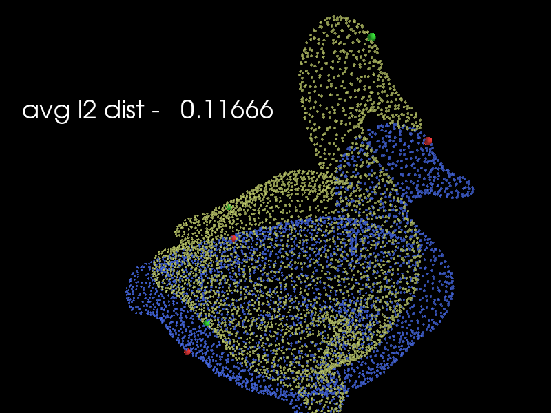
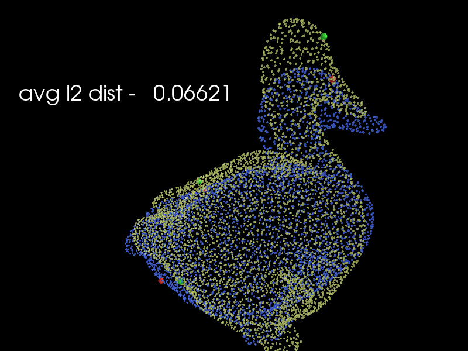
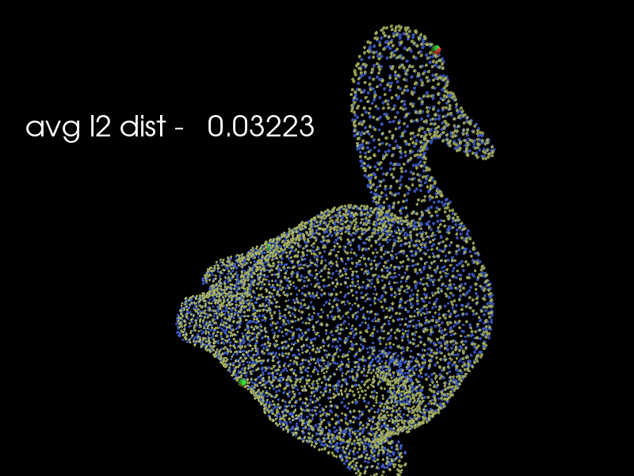

# ICP [iterative closest point]
A python implementation of the ICP (rigid and non rigid) algorithm for shapes (point-cloud) alignment, using tensorflow-gpu.,
using tensorflow-gpu.

## Dependencies
### Code tested on:
ubuntu 18.04\
python 3.7.3\
conda version : 4.8.0\
tensorflow 2.0.0

## Usage
please run example_script/runme.py

## Example
original\

rigid alignment\

non-rigid-alignment\

